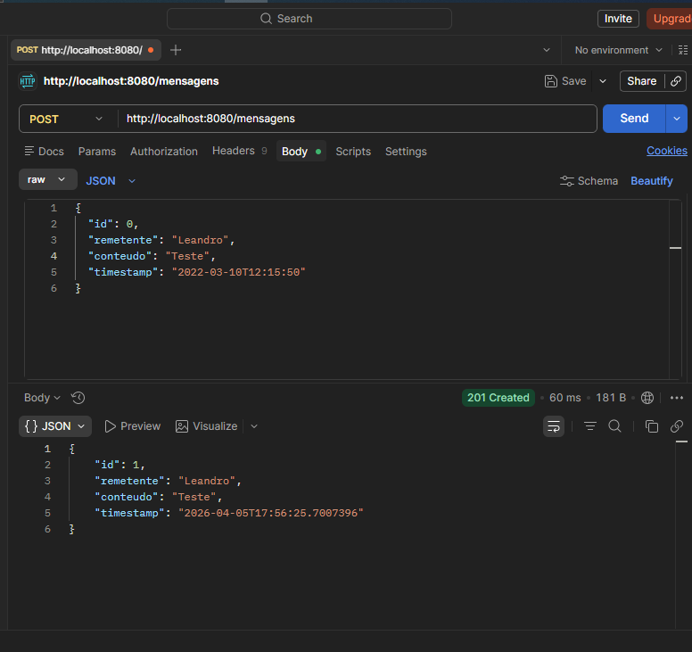
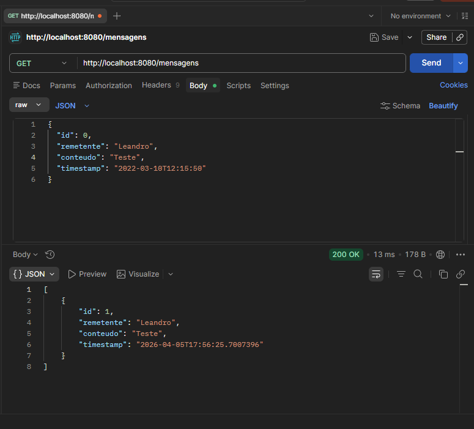
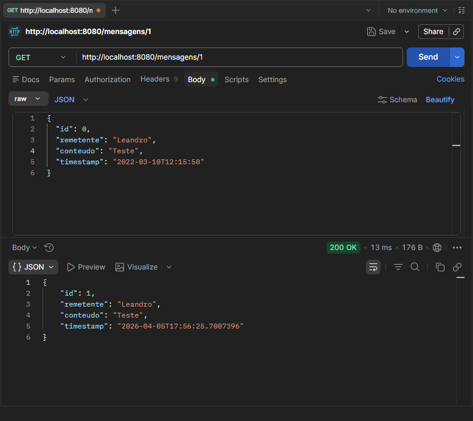
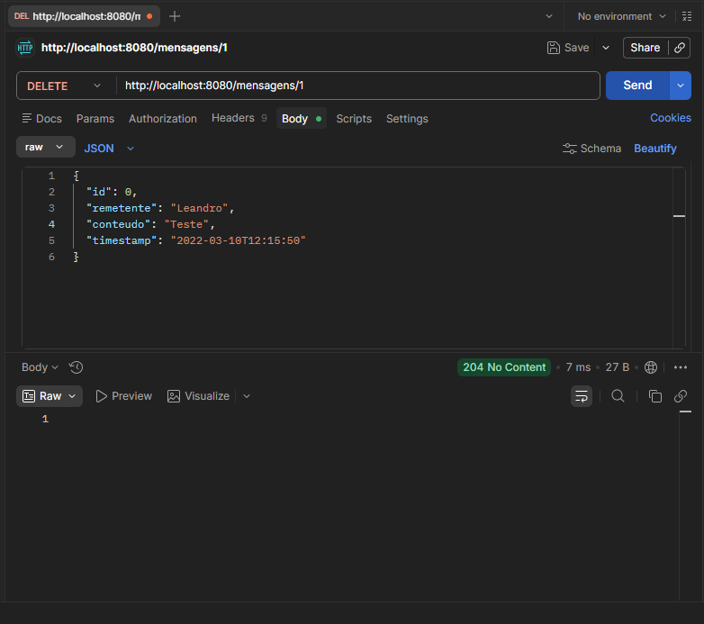

## 4. Relatório

### 4.1 Arquitetura da Solução

A aplicação foi desenvolvida utilizando o framework Quarkus, seguindo o padrão arquitetural em camadas (Controller, Service e Repository), com o objetivo de simular a troca de mensagens entre processos distribuídos por meio de uma API REST.

#### Fluxo de uma requisição POST /mensagens

O fluxo de envio de uma mensagem ocorre da seguinte forma:

1. O cliente (Sender), que pode ser uma ferramenta como Postman ou outro sistema, realiza uma requisição HTTP do tipo POST para o endpoint `/mensagens`.

2. Essa requisição utiliza o protocolo HTTP para encapsular os dados da mensagem no corpo (body) da requisição, geralmente no formato JSON. 

3. O servidor, implementado com Quarkus (Receiver), recebe essa requisição através da classe Controller, que está mapeada com a anotação `@Path("/mensagens")` e o método anotado com `@POST`.

4. O Controller delega o processamento da requisição para a camada de Service, responsável pelas regras de negócio, como a atribuição de timestamp e validações.

5. A camada Service, por sua vez, utiliza o Repository para persistir a mensagem em uma estrutura de dados em memória (lista).

6. Após o processamento, o servidor retorna uma resposta HTTP ao cliente, contendo o status `201 Created` e o objeto da mensagem criada.

Esse fluxo simula a comunicação entre processos distribuídos, onde o cliente atua como emissor da mensagem e o servidor como receptor.

---

#### Sender e Receiver

* **Sender (Remetente):** é o cliente que inicia a comunicação. Pode ser o Postman, um frontend ou outro serviço. Ele envia requisições HTTP contendo os dados da mensagem.

* **Receiver (Receptor):** é a aplicação desenvolvida com Quarkus, responsável por receber, processar e armazenar as mensagens.

---

#### Encapsulamento via protocolo HTTP

O protocolo HTTP é responsável por transportar a mensagem entre o cliente e o servidor. Ele encapsula as informações em uma estrutura composta por:

* Método HTTP (POST, GET, DELETE)
* Cabeçalhos (headers), como `Content-Type: application/json`
* Corpo da requisição (body), contendo os dados da mensagem em formato JSON

Dessa forma, o HTTP atua como um meio de comunicação padronizado entre sistemas distribuídos.

---

### Mapeamento Teórico: Send e Receive

Os métodos HTTP utilizados na aplicação podem ser associados aos conceitos de envio (Send) e recebimento (Receive) estudados em sistemas distribuídos:

* **POST /mensagens (Send):**
  Representa o envio de uma mensagem do cliente para o servidor. O cliente atua como emissor (Sender), transmitindo dados que serão recebidos e processados pelo servidor.

* **GET /mensagens (Receive):**
  Representa a recuperação das mensagens armazenadas. O cliente solicita ao servidor as mensagens já recebidas, funcionando como um consumidor dessas informações.

* **GET /mensagens/{id} (Receive específico):**
  Permite acessar uma mensagem específica, funcionando como uma operação de leitura direcionada.

* **DELETE /mensagens/{id}:**
  Representa a remoção de uma mensagem, simulando a exclusão de dados após processamento ou consumo, o que pode estar relacionado ao ciclo de vida de mensagens em sistemas distribuídos.

---

## 📸 Evidências de Funcionamento da API

A seguir são apresentadas evidências do funcionamento dos principais endpoints da API desenvolvida. Os testes foram realizados utilizando ferramenta de requisições HTTP (como Postman), demonstrando o comportamento esperado de cada operação.

---

### 🔹 Criação de Mensagem (POST /mensagens)

Esta imagem demonstra o envio de uma nova mensagem para a API.
O cliente envia um payload JSON contendo o remetente e o conteúdo, e o sistema retorna a mensagem criada com ID e timestamp.

  

---

### 🔹 Listagem de Mensagens (GET /mensagens)

Nesta etapa é exibida a recuperação de todas as mensagens armazenadas em memória.
A resposta retorna uma lista contendo todas as mensagens previamente enviadas.

  

---

### 🔹 Busca por ID (GET /mensagens/{id})

Aqui é possível observar a consulta de uma mensagem específica a partir do seu identificador único.
A API retorna os dados da mensagem correspondente ao ID informado.

  

---

### 🔹 Remoção de Mensagem (DELETE /mensagens/{id})

Esta imagem demonstra a exclusão de uma mensagem do sistema.
Após a requisição, a API retorna um status indicando sucesso na operação.

  

---

### 🔹 Validação após Exclusão (GET após DELETE)

Após a remoção, é realizada uma nova requisição de listagem para confirmar que a mensagem foi efetivamente removida.
O resultado evidencia que o item não está mais presente na coleção.

  

---

### 📌 Considerações

As evidências apresentadas comprovam o correto funcionamento dos endpoints REST implementados, incluindo operações de criação, consulta e remoção de mensagens. A API segue o padrão de comunicação HTTP e responde adequadamente aos diferentes tipos de requisições.

### Considerações

A aplicação demonstra, de forma simplificada, como sistemas distribuídos podem se comunicar utilizando protocolos padronizados como o HTTP. Apesar de utilizar armazenamento em memória, a arquitetura adotada permite fácil evolução para cenários mais complexos, como integração com filas de mensagens (RabbitMQ, Kafka) ou bancos de dados persistentes.
